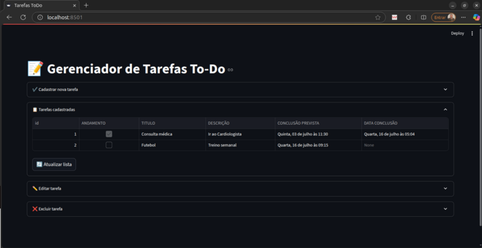
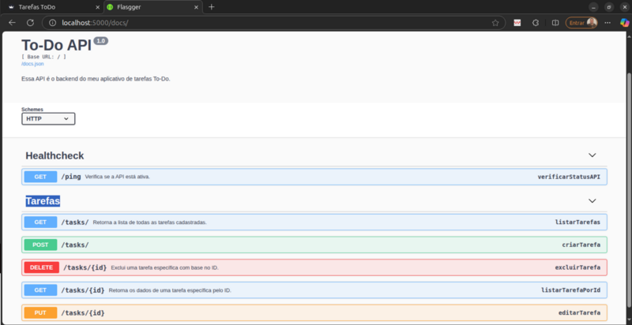

# 📝 Projeto: Gerenciador de Tarefas To-Do (Fullstack com Docker + Flask + Streamlit)

Esse projeto é um desafio pessoal com foco em DevOps, pra montar um portfólio prático e funcional, que abrange desde o backend até o frontend — tudo containerizado e pronto pra subir com um `docker compose up`.

---

## 🚀 Por que esse projeto?

A ideia aqui foi sair da teoria e colocar em prática várias etapas que envolvem um ambiente real de desenvolvimento e deploy.

Criei esse To-Do simples com objetivo de:

- praticar estrutura de microsserviços (back + front isolados)
- trabalhar com banco de dados
- integrar variáveis de ambiente (`.env`)
- empacotar com Docker
- orquestrar com Docker Compose
- deixar tudo pronto para CI/CD no futuro

---

## ⚙️ O que foi usado

O projeto foi dividido em dois serviços principais:

### 🧠 Backend

- **Flask** com estrutura modular (blueprints)
- Banco de dados **SQLite** usando SQLAlchemy
- Documentação automática com **Flasgger** acessível via `/docs`
- Variáveis de ambiente via `python-dotenv`
- Roteamento completo para CRUD de tarefas

### 💡 Frontend

- **Streamlit** para visualização e controle das tarefas
- Tela única com abas para listar, editar, criar e excluir tarefas
- Comunicação com a API via `requests`

### 🐳 Infraestrutura

- Dockerfile separado para front e back
- `.env` isolado para backend
- Compose para orquestrar tudo com 1 comando

---

## 🧠 Como funciona?


*Interface do frontend feita em Streamlit, com abas para listar, editar e excluir tarefas.*


*Documentação da API Flask gerada automaticamente com Flasgger, acessível em `/docs`.*

A interface web em Streamlit se conecta com a API Flask para realizar operações de:

- criar nova tarefa
- visualizar todas as tarefas
- editar tarefa existente
- excluir tarefa pelo ID
- marcar/desmarcar como concluída

Tudo isso usando o banco SQLite embarcado e com persistência garantida via volume (se quiser).

A API conta ainda com documentação interativa acessando `http://localhost:5000/docs`.

---

## 🐳 Como rodar o projeto?

Simples. Após clonar:

```bash
docker compose up --build
```

Tudo já configurado pra rodar de primeira, desde que tenha Docker e Docker Compose instalados.

---

## 📚 Stacks e conhecimentos aplicados

- Python 3.12
- Flask
- Streamlit
- SQLAlchemy
- Docker
- Docker Compose
- Arquitetura de microsserviços
- Manipulação de variáveis com `.env`
- Criação e consumo de API REST
- Modularização de projetos em Flask
- Markdown, documentação e boas práticas

---

## 🔄 Em desenvolvimento

- CI/CD com GitHub Actions
- Testes automatizados
- Ajustes visuais no frontend
- Refinamento do código

---

Projeto de gaveta que veio de uma ideia para automatizar rotina? Talvez.  
Portfólio prático e que mostra conhecimento? Com certeza.

💻 Bora codar e evoluir sempre.
